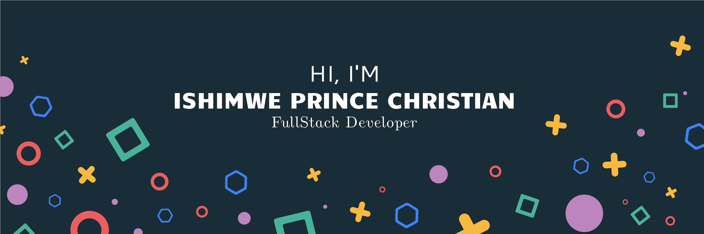

  
    Hey there 👋   I’m Prince Christian, a Junior full-stack Developer. I make it my mission to translate user-focused designs into pixel-perfect websites or applications that run blazing fast. 

Want to know more about me? [Check out my portfolio.](https://princechrix.netlify.app/)

## &#x1f4c8; GitHub Stats
 

   

 
 

## 💼 Skills

More Skills

 

 

